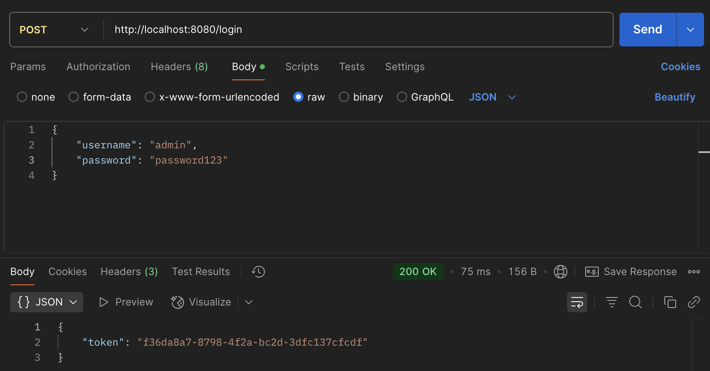
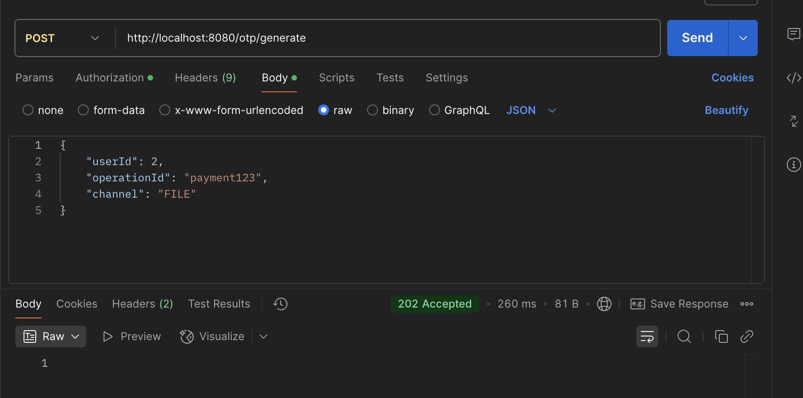
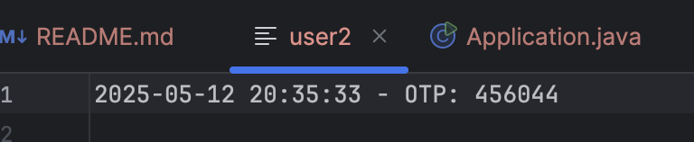
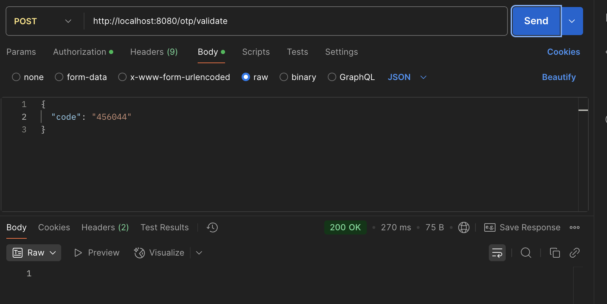
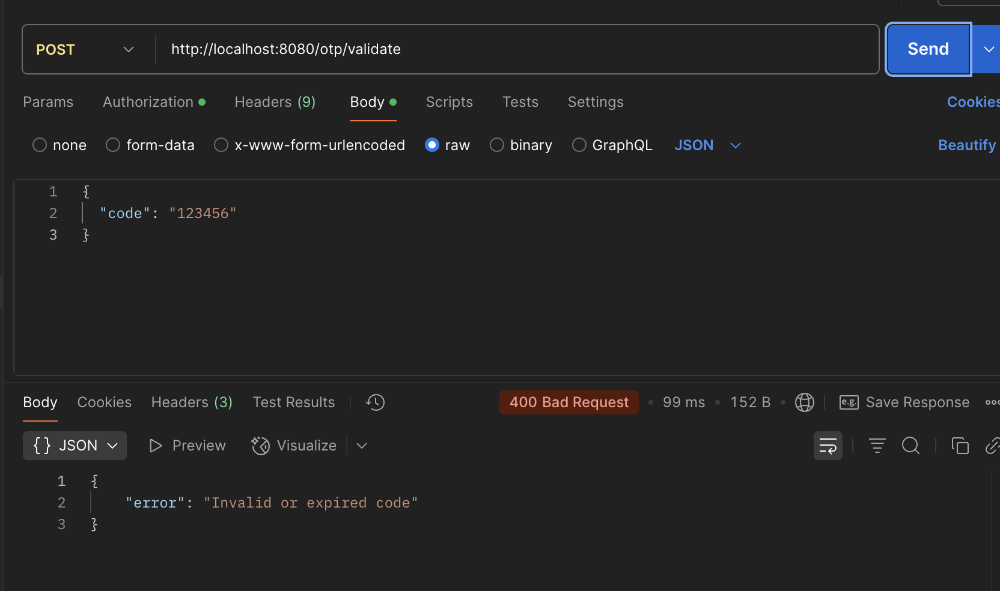

# Тестирование OTP Service с использованием Postman
Программа была протемтирована в Postman
## Содержание

1. [Регистрация пользователей](#регистрация-пользователей)
   - [Регистрация обычного пользователя](#регистрация-обычного-пользователя)
   - [Регистрация администратора](#регистрация-администратора)
2. [Аутентификация](#аутентификация)
3. [Управление OTP кодами](#управление-otp-кодами)
   - [Генерация OTP кода](#генерация-otp-кода)
   - [Проверка OTP кода](#проверка-otp-кода)
4. [Административные функции](#административные-функции)
   - [Обновление конфигурации](#обновление-конфигурации)
   - [Получение списка пользователей](#получение-списка-пользователей)
   - [Удаление пользователя](#удаление-пользователя)

## Регистрация пользователей

### Регистрация обычного пользователя

Для регистрации обычного пользователя отправьте POST запрос на `/register` с данными пользователя:

### Регистрация админа

Для регистрации администратора укажите роль "ADMIN" в запросе:

## Аутентификация

После регистрации вы можете войти в систему, отправив POST запрос на `/login`:

В ответе вы получите JWT токен, который нужно использовать для авторизации в последующих запросах.

## Управление OTP кодами

### Генерация OTP кода

Для генерации OTP кода отправьте POST запрос на `/otp/generate` с указанием пользователя, операции и канала доставки:

При использовании канала FILE, OTP код будет сохранен в файл:

### Проверка OTP кода

#### Проверка верного кода

Для проверки OTP кода отправьте POST запрос на `/otp/validate` с кодом:

#### Проверка неверного кода

При отправке неверного кода вы получите соответствующее сообщение об ошибке:

## Административные функции

Следующие функции доступны только пользователям с ролью ADMIN.

### Обновление конфигурации

Для изменения параметров OTP (длина кода, время жизни) отправьте PATCH запрос на `/admin/config`:

### Получение списка пользователей

Для получения списка всех пользователей отправьте GET запрос на `/admin/users`:

### Удаление пользователя

Для удаления пользователя отправьте DELETE запрос на `/admin/users/{userId}`:

После удаления можно проверить, что пользователь действительно удален, запросив список пользователей:

